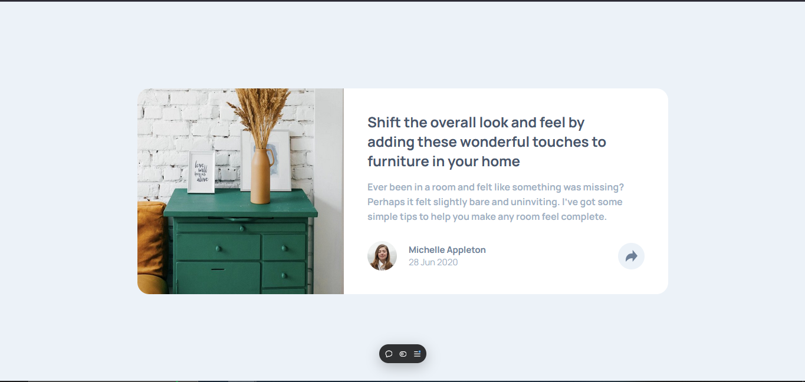
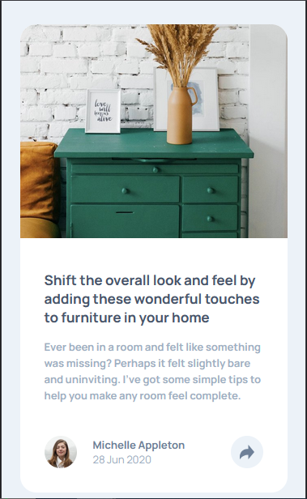

<h1 align="center">Front-End Mentor Article Preview</h1>

  Projeto da <a href="https://www.frontendmentor.io/challenges/article-preview-component-dYBN_pYFT">Article Preview Component</a>.

### 🖥 Desktop

  

### 📱 Mobile

  

 

## 🚀 Tecnologias

- HTML e CSS(com responsividade)

## 💻 Projeto

Projeto para entrar nos conceitos de Front-End e desenvolvimento web.